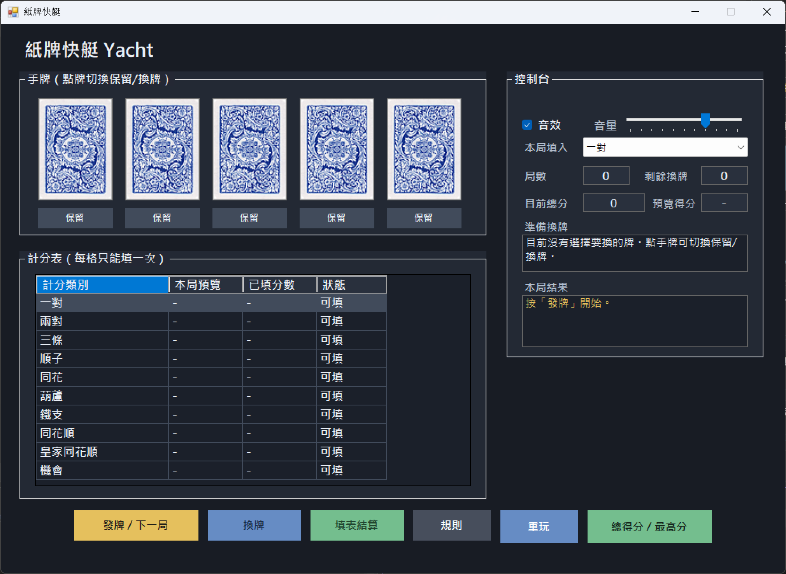

# 牌艇 Yacht Poker

牌艇是一款撲克牌計分遊戲。玩法把快艇骰子的多次重擲，改成撲克牌的換牌、湊牌型、填表計分。每局玩家拿到5張手牌，在最多3次換牌後選擇一個欄位填分，目標是把整張表的總分最大化。

## 功能

- 單人玩法，使用類似快艇骰子的計分表。
- 每局固定 5 張手牌，最多可換牌 3 次。
- 結算前可選擇本局要填入的計分欄位，每格只能填一次。
- 提供音效開關與音量控制。
- 會記錄歷史最高分。
- 可在遊戲內查看完整規則。

## 計分欄位

每局結算前，玩家要選擇一個尚未使用的欄位填入。若實際牌型符合欄位就得分，不符合則該格得 0 分；「機會」欄直接計算 5 張牌點數總和（A 算 14）。

| 欄位 | 基礎分 |
|---|---:|
| 一對 | 10 |
| 兩對 | 20 |
| 三條 | 30 |
| 順子 | 40 |
| 同花 | 50 |
| 葫蘆 | 60 |
| 鐵支 | 80 |
| 同花順 | 120 |
| 皇家同花順 | 200 |
| 機會 | 5 張牌點數總和（A 算 14） |

## 怎麼玩

1. 按「發牌 / 下一局」開始一局。
2. 點選手牌，牌下方顯示「換牌」代表要換掉。
3. 按「換牌」更換標記的牌（每局最多 2 次）。
4. 選擇「本局填入」的計分欄位。
5. 按「填表結算」把分數填進計分表。
6. 計分表填滿後會跳窗顯示本局總分與歷史最高分，並可直接選擇是否重玩。
7. 按「總得分 / 最高分」可隨時查看目前總分與歷史最高分。
8. 按「規則」可在遊戲內查看完整玩法說明。

## 需要

- Windows 7 以上
- .NET Framework 4.7.2
- Visual Studio 或 MSBuild

## 編譯

用 Visual Studio 開啟 `Poker.sln`，按 F5 執行。

也可以使用 Visual Studio MSBuild：

```sh
MSBuild.exe Poker.sln /p:Configuration=Debug
```

## 技術

- C# 7.3
- .NET Framework 4.7.2
- Windows Forms
